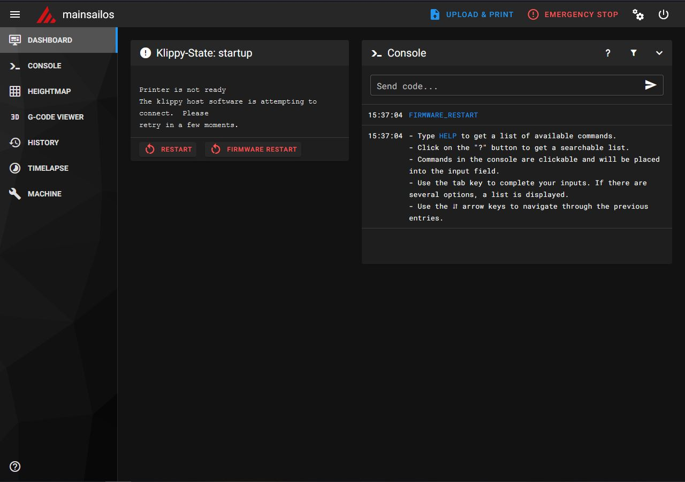
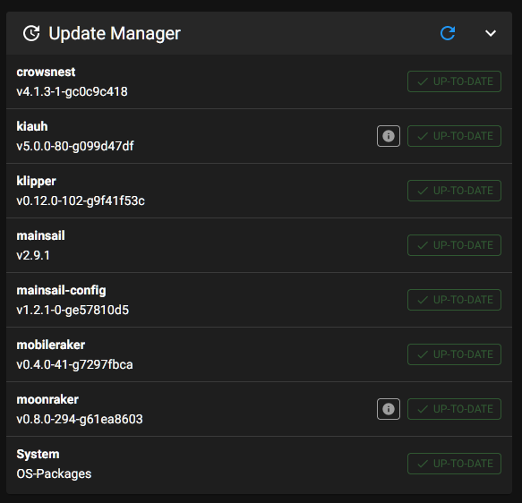

# This Repository is a pre configured Variant of MainsailOS 2.9.1 NEW by Darkwulf3D!!!

## Please Download and unzip it. Flash it to SD with Raspberry Pi Imager or Rufus.

VERY IMPORTANT FIRST !!!

Hi guys, the repository has changed its location to Mega. 
I don't want to and can't continue paying Github LFS like this due to my health situation. 
Please use the link to Mega and download the corresponding repo there. The repos are more basic. 
I left out some more stuff to avoid problems with the new operating systems. 
But you can still install the stuff following the video instructions. 

IMPORTANT NOTE:
The image must be extended with the file "wpa_supplicant.conf" in the boot folder to get wifi.
This file disappears from this folder after the successful setup, as it is copied to the designated position...

## Link to MEGA: https://mega.nz/folder/5Lkm2CpA#bqCsiZo4uSiAjUU68pzmmA

Timelapse and Kiauh pre Installed !!!

