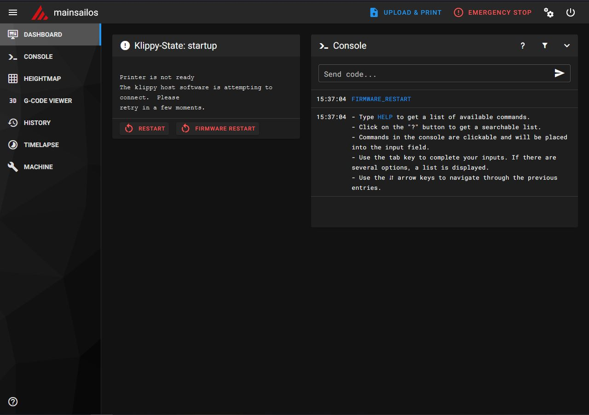
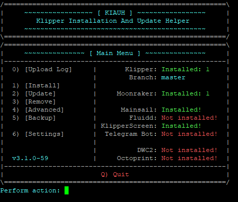
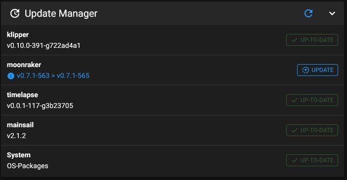
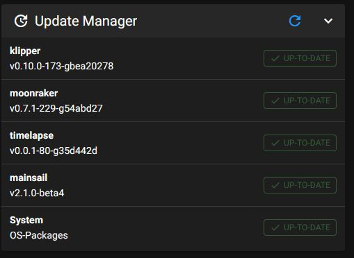

# This Repository is a pre configured Variant of MainsailOS 2.1.2 NEW by Darkwulf3D!!!

## Please Download and unzip it. Flash it to SD with Raspberry Pi Imager or Rufus.

IMPORTANT NOTE:
The image must be extended with the file "wpa_supplicant.conf" in the boot folder to get wifi.
This file disappears from this folder after the successful setup, as it is copied to the designated position...

Timelapse and Kiauh pre Installed !!!

Images for Beta Image:

